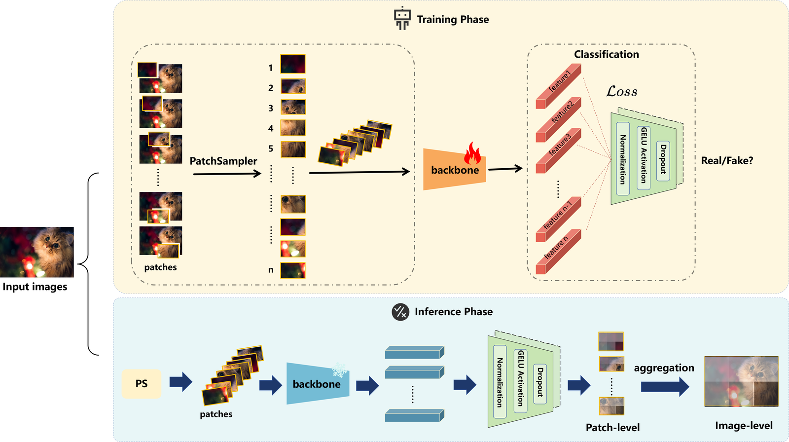
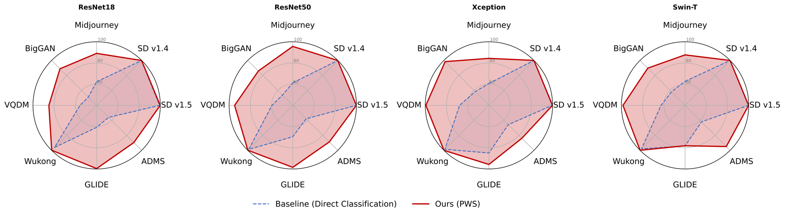

# Look Closer: Patch-wise Supervision for AI-Generated Image Detection

[](https://github.com/LF-Jade/look-closer/actions/workflows/smoke.yml)

Reference implementation of the **multi-patch** pipeline studied in the paper
*Look Closer: Patch-wise Supervision for AI-Generated Image Detection*.



A shared backbone classifies explicit RGB crops. **Every crop receives its own
classification loss** — there is no within-image pooling before the loss — and the
crop probabilities are averaged only at inference, into a single image score. No
handcrafted residual filter, no learned image-level fusion module, and no
truncated backbone are involved.

> **Verification.** `scripts/smoke_test.py` runs in CI on CPU, for ResNet-18 and
> Swin-T. It checks the pipeline's *behaviour* — sampling geometry, collation, both
> supervision modes, checkpoint round-trips, metric conventions, the schedule
> sequence, selection and gating, and error handling — not detection accuracy. See
> [docs/ENVIRONMENT.md](docs/ENVIRONMENT.md).

## Contents

- [Install](#install)
- [Quick start (CPU, no benchmark, no downloads)](#quick-start-cpu-no-benchmark-no-downloads)
- [Train](#train)
- [Evaluate](#evaluate)
- [Input handling: read this before comparing with the paper](#input-handling-read-this-before-comparing-with-the-paper)
- [Data](#data)
- [Reported results](#reported-results)
- [Layout](#layout)
- [What is not included](#what-is-not-included)
- [Paper and citation](#paper-and-citation)
- [License](#license)

## Install

Run all commands from the repository root.

```sh
python -m venv .venv && . .venv/bin/activate
pip install -r requirements.txt
```

## Quick start (CPU, no benchmark, no downloads)

```sh
python scripts/make_synthetic_data.py --out data/synthetic --count 16
python scripts/train.py --config configs/genimage_resnet50.yaml \
    --device cpu \
    --set data.train_manifest=data/synthetic/train.txt \
    --set model.backbone=resnet18 --set model.pretrained=false \
    --set training.epochs=1 --set training.batch_size=4 --set training.num_workers=0
python scripts/evaluate.py --config configs/eval_genimage.yaml \
    --device cpu --set eval.num_workers=0 \
    --set model.backbone=resnet18 \
    --checkpoint runs/genimage_resnet50/final.pth \
    --manifests data/synthetic/eval.txt
```

The synthetic images carry no detection signal, so any metric from them is
meaningless as a performance number — they exist only to exercise the code.

Self-check, which asserts the pipeline's behaviour rather than its accuracy:

```sh
python scripts/smoke_test.py
python scripts/smoke_test.py --backbone swin_tiny_patch4_window7_224
```

## Train

```sh
# the release's ResNet-50 configuration
python scripts/train.py --config configs/genimage_resnet50.yaml

# the Swin-T configuration
python scripts/train.py --config configs/genimage_swin_tiny.yaml

# any config value can be overridden
python scripts/train.py --config configs/genimage_resnet50.yaml \
    --set training.epochs=2 --set training.batch_size=8 --limit 64
```

The resolved configuration is written to `<output_dir>/resolved_config.yaml`.

Checkpoints are written every `training.save_interval` **steps** as
`checkpoint<N>.pth`, where `N` is a save counter; the real epoch and step are
stored inside the file. (The research code named these `epoch<N>.pth`, so a
30-epoch run with `save_interval: 2000` produced 151 files, and the historical
logs' "Epoch 151" line is the 151st save. `scan_checkpoints` still reads that
legacy name.)

## Evaluate

```sh
python scripts/evaluate.py --config configs/eval_genimage.yaml \
    --checkpoint runs/genimage_resnet50/checkpoint151.pth
```

`--scan <exp_dir>` selects by mean accuracy over the manifests you pass, following
the retained evaluator's selection approach; the single-manifest gate behaviour
differs as documented in [SCOPE.md](docs/SCOPE.md). **Pass
`--select-on <held-out manifest>` for any new work** — without it, selection
happens on the reported target sets and the scores are optimistic.

Both `eval.decision_threshold` and `eval.gate_threshold` are 0–1 ratios; the
historical logs printed the gate as a percentage, so `99.5` becomes `0.995`.
`gate_threshold: 0` disables gating. If every candidate fails the gate the command
exits non-zero.

## Input handling: read this before comparing with the paper

`pre_crop_resize` defaults to **`null`** — crop at the source resolution, which
matches the default multi-patch setting described in the manuscript. Setting it to
`299` selects the resize-before-crop ablation path retained in the original
sampler.

Neither setting is a full reproduction of a historical pipeline: the manuscript's
resolution-aligned control also *enlarges the extracted patches* to the backbone
input size afterwards, and this release does not support that (`model.input_size`
is bound to `sampling.patch_size`). See
[docs/SCOPE.md](docs/SCOPE.md#four-settings-that-must-not-be-conflated) for the
four settings that must be kept apart — manuscript, retained snapshot, this
release's default, and what has actually been verified here.

## Data

One image per line: `<image path><whitespace><0|1>`, resolved relative to the
working directory (absolute paths are also accepted). No datasets, manifests or
checkpoints are shipped; see [docs/DATA.md](docs/DATA.md) for the format and for
which public benchmarks the paper uses.

## Reported results



Reported GenImage mean accuracies for the whole-image baselines and for PWS across
four backbones. These are the paper's reported numbers, shown for orientation
only. The paper's Section 5.1 documents that the historical selection histories
are not consistently matched or fully recovered, so these gaps should not be read
as the direction or magnitude of gains under a common evaluation protocol.

## Layout

```
look_closer/          # the method
  sampler.py          # patch extraction (pre-crop resize, grid, capped subset)
  data.py             # manifest parsing + patch collation
  models.py           # shared backbone + shared head
  losses.py           # per-patch focal loss; image-level control loss
  engine.py           # shared train loop, image-level inference, checkpoint helpers
  utils.py            # seeding, config, optimiser, cosine schedule
configs/              # ResNet-50 and Swin-T recipes, evaluation config
scripts/              # train / evaluate / smoke_test / make_synthetic_data
baselines/            # image-level control (same loop, loss after logit averaging)
tools/                # manifest subsampling utility
docs/                 # data format, environment, scope and limitations
assets/               # figures used by this README
.github/workflows/    # CPU smoke test
CITATION.cff          # machine-readable citation
```

## What is not included

* **Detector checkpoints** — train your own with `scripts/train.py`.
* **The single-patch selection study (SPD)** — this repository covers the
  multi-patch pipeline only.
* **Datasets** — obtain them from their official sources; see
  [docs/DATA.md](docs/DATA.md).

For how the released configuration relates to the reported runs, and what the
historical checkpoint-selection records mean for the reported numbers, see
[docs/SCOPE.md](docs/SCOPE.md).

## Paper and citation

**Look Closer: Patch-wise Supervision for AI-Generated Image Detection**
Zhida Zhang, Tao Wu, Siyu Liu, Jie Cao

<!-- Update this line with the arXiv URL once the preprint is posted. -->
The preprint is being prepared for arXiv; the link will be added here when it is
posted. Until then, please cite this repository:

```bibtex
@misc{lookcloser2026,
  title        = {Look Closer: Patch-wise Supervision for AI-Generated Image Detection},
  author       = {Zhang, Zhida and Wu, Tao and Liu, Siyu and Cao, Jie},
  year         = {2026},
  note         = {Preprint},
  howpublished = {\url{https://github.com/LF-Jade/look-closer}}
}
```

## License

[MIT](LICENSE).
